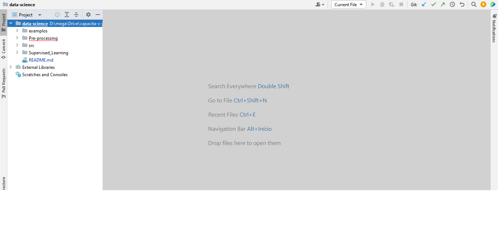

## data-science 
Repositório destinado ao curso Capacita C-Jovem

##  Link para Apresentação das aulas
https://docs.google.com/presentation/d/1jqBXGVkJ4DFNVlt0Qzhy2ElR-l-Cl_e3LKxKaiTBckc/edit#slide=id.gc6f919934_0_0

## Instruções aos alunos

1) Realize o dowload do repositório em formato zip ou clone o mesmo em um local apropriado no seu computador
2) Instale o Pycharm - https://www.jetbrains.com/pycharm/download/?section=windows
3) Instale o anaconda - https://repo.anaconda.com/archive/Anaconda3-2024.06-1-Windows-x86_64.exe
4) Abra a pasta do repositório (extrair do zip,caso tenha feito download zip) com o pycharm, considere a pasta raíz sendo data-science. O repositorio deverá ser visualizado como mostrado na figura seguinte:

5) Configure o ambiente Python - https://www.jetbrains.com/help/pycharm/creating-virtual-environment.html
6)  instale algumas bibliotecas importantes: 

    ``pip install -r requirements.txt``
7) Execute o código [0_class_anotation.py](Pre-processing%2FUnidade1%2F0_class_anotation.py). Este deve funcionar sem apresentar erros.
